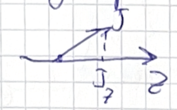

### Kinematics and Variables in Two-Body Scattering Processes

Today we are at lecture number five.
We'll discuss angular distributions and partial wave analysis.
But before going there, I would like to start with a recap.

The last lecture we discussed the phase space for particle reactions and we discussed different experiments and their kinematics.
We went through the list of experiments around the world that study hadrons and look at their production mechanisms and some peculiarities.
We start with a recap on kinematics.
The first question: how many variables does one need to describe a two-particle scattering process?

We have a two-particle process.
First, consider scalar particles — for example, spin-0 pseudoscalars ("0 minus").
Two such scalar particles scatter into two final-state scalar particles.
Second, consider the case with spin — for example, scattering a 0⁻ particle into a 3⁻ and a 1⁺ final state.

::: callout-note
The "blob" in scattering diagrams represents the interaction region — where strong, electromagnetic, or other forces act. Arrows show incoming and outgoing particles. These are not Feynman diagrams; they are sometimes called unitarity diagrams. 

{#fig-fg1}

:::

We are only discussing kinematics here — whatever happens inside the blob does not change the number of variables needed.

**How many variables describe the full kinematics?**

For two incoming and two outgoing particles:

- Each particle has a 4-momentum: 4 particles × 4 components = 16 numbers.
- Momentum conservation imposes 4 constraints: 16 − 4 = 12.
- We can always boost or rotate the system: subtract 6 (3 rotations + 3 boosts) → 12 − 6 = 6 remaining degrees of freedom.
- But for a 2 → 2 process, only **2 variables** are independent and physically meaningful — the rest are redundant due to symmetries.

For spinless particles, the scattering amplitude is a scalar function of these two variables.
When particles have spin, the amplitude becomes a multi-component object — for example, for a 3⁻ and 1⁺ final state, the amplitude has 7 × 3 = 21 components — but each component still depends on the same **two kinematic variables**.

::: callout-important
Even with spin, the number of independent kinematic variables remains two. Spin only increases the number of amplitude components, not the kinematic degrees of freedom.
:::
**What are good choices for these two variables?**

Common choices include:

- **Mandelstam invariants**:
- $s = (p_1 + p_2)^2$ — the invariant mass squared of the initial system.
- $t = (p_1 - p_3)^2$ — the momentum transfer squared.
- $u = (p_1 - p_4)^2$ is related by $s + t + u = \sum m_i^2$.

- **Center-of-mass energy and scattering angle**:
- $\sqrt{s}$ — total energy in the CM frame.
- $\theta$ — angle between $\vec{p}_1$ and $\vec{p}_3$ in the CM frame.

Any two independent variables work, but some choices (like $s$ and $t$) are Lorentz invariant and avoid unphysical foldings in phase space.

Now, moving to three-body decays — such as in Dalitz plot analysis — we again need **two variables** to fully describe the kinematics. 

![3 The Dalitz plot, a representation of the phase-space for the three-body decay. It appears as an ellipse-shaped area where the internal region corresponds to allowed kinematics and the outside region is forbidden. On the x-axis lies the squared mass of two final-state particles, while the y-axis corresponds to the other subsystem. A horizontal line represents a slice of the phase-space with one mass fixed. The borders of the area correspond to configurations where all three momenta are aligned in the rest frame of the decaying particle, or equivalently, where the scattering angle in the relevant rest frame is either 0 or π.](images/fig3.png){#fig-fg3}

::: callout-tip
In a three-body decay, the differential decay rate plotted against two Mandelstam variables (e.g., $m_{12}^2$ and $m_{23}^2$) is flat in phase space — meaning the density directly reflects the dynamics of the interaction, without kinematic distortion.
:::
The three-body phase space can be written recursively using two-body phase spaces:

{#fig-fg2}

$$
d\Phi_3 = d\Phi_2(m_{12}^2) \cdot d\Phi_2(m_{34}^2) \cdot \frac{dm_{34}^2}{2\pi}
$$

where the two-body phase space element is:

$$
d\Phi_2 = \frac{1}{8\pi} \frac{2|\vec{p}|}{\sqrt{s}} \frac{d\Omega}{4\pi}
$$

This structure leads to a constant Jacobian when using invariant mass squares — making Dalitz plots a powerful tool for studying resonance structures and dynamics in hadron spectroscopy.

We will continue with angular distributions and Dalitz plots in the next part of the lecture.

### Λ_c Baryon Decay Kinematics and Dalitz Plot Analysis

Let’s examine the decay Λₐ⁺ → p K⁻ π⁺ as an example.
We measure Λₐ baryons produced in proton-proton collisions.
Experiments such as BES and Belle also observe Λₐ decays.
This is one of the charm ground-state baryons: it lives long enough and is produced abundantly.
Such charm ground-state particles are produced in large numbers and live sufficiently long to travel a measurable distance from the primary vertex before decaying.
We reconstruct them by detecting their decay products.
That is why we have a large sample and a good understanding of their decay kinematics—not only kinematics but also dynamics, meaning the internal structure of the decay amplitude.

In this decay, a charm quark is present in the initial state but absent in the final state, indicating the process occurs via the **weak interaction**.
The charm quark disappears between initial and final states.
Specifically, the charm quark decays into a strange quark, which ends up inside the kaon.
The transition **c → s** happens within the same generation and is **not suppressed**; it is an allowed Cabibbo-favored process.

This decay is considered a **golden channel** for detection.
The final state consists of three charged particles with no neutrals:

- The proton is charged and stable on detector timescales.
- The kaon is stable in our experimental environment.
- The pion is also stable.

Without neutral particles to complicate reconstruction, all three charged tracks fly outward from the decay vertex.
We observe clean tracks through the detector layers and see that they originate away from the primary interaction point.

::: callout-note
The observed decay length of Λₐ in the lab frame is around **1 cm**, due to relativistic time dilation:
$$
\tau_{\text{lab}} = \gamma \, \tau_{\text{rest}}, \quad \gamma = \frac{E_{\Lambda_c}}{m_{\Lambda_c}}
$$
Since Λₐ is produced with several hundred GeV in LHC proton-proton collisions, its boosted lifetime allows it to travel a measurable distance.
:::

We now turn to a Dalitz plot analysis. Refer to @fig-fg3
The following plot resembles real experimental data—in fact, with such high statistics, the actual data would look just as smooth.

- **x-axis**: invariant mass squared of the proton and kaon,
$$
m_{pK}^2 = (p_p + p_K)^2
$$

- **y-axis**: invariant mass squared of the kaon and pion,
$$
m_{K\pi}^2 = (p_K + p_\pi)^2
$$

The colored region shows all **kinematically allowed values** for the decay; the white area corresponds to kinematically forbidden configurations. Refer to @fig-fg3

::: callout-tip
Each point in the Dalitz plot corresponds to a unique set of four-momenta for the final-state particles.
If you pick a point inside the colored region, you can compute angles and construct the physical configuration.
A point in the white region would violate energy-momentum conservation.
:::
The differential decay rate is given by
$$
d\Gamma = \frac{1}{2m_{\Lambda_c}} |\mathcal{M}|^2 \, d\Phi_3
$$
where $|\mathcal{M}|^2$ contains the dynamics and $d\Phi_3$ is the Lorentz-invariant three-body phase space.

Different colors on the plot indicate different probabilities—certain kinematic configurations are preferred.
Particles tend to be emitted in specific directions relative to one another.

To interpret the structure:

- On the **border** of the Dalitz plot, two particles become **collinear**.
- The location where the invariant mass of a pair is maximized corresponds to a boundary point.

Try to identify these borders in the plot:
Where do two particles align?
How does that affect the invariant mass?

### Dalitz Plot Kinematics and Angular Distributions

Okay, any thoughts? Let's reason through the kinematics. I think the point should be in the bottom right of the Dalitz plot because we want to **maximize the invariant mass** of one pair.

My initial idea was that with three momenta going out, if they are in opposite directions, the total three-momentum sum should be as small as possible. Conversely, if we add momentum vectors in the same direction, the sum of their squares should be as large as possible, placing us on the right side of the diagram.

The key question is: should the mass on the y-axis be as large or as small as possible? The answer is **as small as possible**.

::: callout-important
The invariant mass squared for two particles is given by $m_{12}^2 = (p_1 + p_2)^2 = (E_1 + E_2)^2 - (\vec{p}_1 + \vec{p}_2)^2$. When the three-momenta are aligned, we subtract them, leading to a smaller invariant mass.
:::
Why is it minimal? Because when the three momenta are collinear, we subtract them in the mass calculation. Another way to think about it: if you boost to the rest frame of the $K$ and $\pi$, they might be nearly at rest relative to each other. In that case, their relative momentum is small, and their invariant mass would be close to the sum of their rest masses, which is the **minimum** possible for that pair.

Therefore, we are looking for the **minimal mass** of the $K\pi$ system. Let's figure out what this point on the plot corresponds to kinematically. There is a configuration where two particles are produced back-to-back from a decay at rest; that corresponds to the point of maximum mass. The point we are discussing is the one that minimizes the mass.

This plot is from experimental data. A practical question is: how do we reconstruct such a case in an experiment where we do not detect the proton? We measure everything in the lab frame, which is boosted relative to the center-of-momentum frame. Despite the problem being addressed in the lab frame, the kinematic features like the maximum mass (particles going back-to-back) and the minimum mass are still identifiable.

For a three-body decay, there is a standard way to define the angles for analysis.

*   **Step 1:** I will boost into the rest frame of a specific pair, for example, the $K\pi$ system.
*   **Step 2:** In the $K\pi$ rest frame, the kaon and pion are back-to-back.
*   **Step 3:** In the overall center-of-momentum frame, all three particles ($\Lambda_c$, $K$, $\pi$) have momenta that sum to zero. After boosting to the $K\pi$ rest frame, the $\Lambda_c$ has a non-zero momentum, while the $K$ and $\pi$ momenta add to zero.

If I fix the invariant mass of the $K\pi$ system, the magnitudes of the momentum vectors in their rest frame are fixed. The only variable that changes is the angle $\theta$ between the direction of the $\Lambda_c$ and one of the decay products in the $K\pi$ rest frame. By scanning $\theta$ from $0$ to $\pi$, I explore the entire phase space along a line of fixed $m_{K\pi}$. Refer to @fig-fg3

::: callout-note
The dependence of the invariant mass of two particles on the angle between them is given by the term $(\vec{p}_1 + \vec{p}_2)^2$ in the mass formula. A wider angle leads to a smaller vector sum and thus a **smaller** invariant mass. A smaller angle (particles moving in similar directions) leads to a **larger** invariant mass.
:::
So, for the proton and $K\pi$ system, when the angle $\theta$ is zero, they are moving in the same direction, resulting in a high invariant mass $m_{p(K\pi)}$. When the angle is $\pi$, they are moving in opposite directions, resulting in a small invariant mass. The most straightforward analysis is to go to the rest frame of one pair (e.g., proton-$K$) where everything is fixed, and scan the Dalitz plot by changing the angle of the third particle.

Another variable in $2 \to 2$ scattering is the $u$-channel Mandelstam variable. For three particles, it's a linear combination of the invariant masses and appears as a diagonal line on the Dalitz plot.

The common experimental representation is the **Dalitz plot** itself, where the x-axis is the squared invariant mass of one pair (e.g., $m_{K\pi}^2$) and the y-axis is the squared invariant mass of another pair (e.g., $m_{pK}^2$). Refer to @fig-fg3

There is also a more symmetric representation using an equilateral triangle. The distance from any point inside an equilateral triangle to its three sides sums to a constant. This property allows us to define variables where the masses of the three possible particle pairs are represented symmetrically.

*   **Variable 1:** Distance to side 1 $\propto m_{AB}^2$
*   **Variable 2:** Distance to side 2 $\propto m_{AC}^2$
*   **Variable 3:** Distance to side 3 $\propto m_{BC}^2$

::: callout-tip
This symmetric representation is related to the standard rectangular plot by a linear transformation (a skew) involving factors like $\sqrt{3}/2$ due to the 60° angles. It's a nice way to visualize the kinematics symmetrically, but the rectangular plot is more common and easier to work with.
:::
The objective of these kinematic representations is to understand the dynamics. What we often see is that the decay $\Lambda_c^+ \to p K^- \pi^+$ does not proceed directly but via **intermediate resonances**.

*   For a brief moment, two particles form an intermediate state that then decays.
*   This resonance enhances the decay probability when the invariant mass of the two particles is close to the resonance mass.
*   This appears as a band or increased density on the Dalitz plot.

If you project the density onto one axis (e.g., $m_{K\pi}$), you would see a bump, similar to a cross-section resonance curve. This leads to the appearance of band structures on the Dalitz plot.

Let's identify the bands on the plot:

*   **Horizontal bands** correspond to a fixed mass of the $K\pi$ system. These are resonances like the $K^*$ which decays to $K\pi$.
*   **Vertical bands** correspond to a fixed mass of the proton-$K$ system. These are resonances in the $pK$ system.
*   The third combination, $\pi p$, corresponds to resonances like the $\Delta$, which appear as diagonal bands.

In the symmetric triangle plot, these bands are parallel to the sides of the triangle.

Questions on the angular distribution? The final point is that within a resonance band on the Dalitz plot, the distribution is not uniform. As we traverse the band by changing the angle $\theta$, the probability can vary.

This **angular dependence** occurs because the intermediate resonance (e.g., the $K^*$) has a spin. The spin of the particle causes an inhomogeneity in the angular distributions. Particles may prefer to be aligned rather than perpendicular. This preference is a powerful tool for measuring spin and other quantum numbers.

::: callout-important
For a resonance of spin $J$ decaying to two spinless particles, the angular distribution in its rest frame is proportional to the square of a Wigner d-function: $\frac{d\Gamma}{d\cos\theta} \propto |d^J_{m,0}(\theta)|^2$. The number of nodes (zeros) in this distribution can directly indicate the spin $J$.
:::
Particles with higher spin produce more structured distributions. However, if the initial state is unpolarized and the final state spins are not measured, the distributions are averaged and smeared, potentially removing clear nodes.

A particle with spin $J$ has $2J+1$ possible spin projections $m$ onto a quantization axis (z-axis). 

{#fig-fg4}

 The state is a vector with $2J+1$ components. Operators acting on this state are matrices.

When I rotate a state $|J, m\rangle$, I generally get a mixture of all possible $m$ states. The coefficients for this transformation are given by the **Wigner D-matrix**.

For a rotation parameterized by Euler angles $(\phi, \theta, \gamma)$, the transformation is:
$$
|J, m'\rangle = \sum_m D^J_{m'm}(\phi, \theta, \gamma) |J, m\rangle
$$
where the D-matrix is:
$$
D^J_{m'm}(\phi, \theta, \gamma) = e^{-i m' \gamma} d^J_{m'm}(\theta) e^{-i m \phi}
$$

The $d^J_{m'm}(\theta)$ functions are the Wigner small-d matrices, which are real and depend only on the rotation angle $\theta$ about the y-axis. These functions are tabulated and essential for calculating angular distributions in particle decays.

### Rotational Properties and Angular Distributions in Particle Decays

Let's consider a small example: spin one half. I'm going to rotate the state $|1/2, 1/2\rangle$ by 30 degrees about the Y axis. I will get a combination of $|1/2, 1/2\rangle$ and $|1/2, -1/2\rangle$, and I want you to quickly tell me what the coefficients are.

These coefficients are found in the same place as the Clebsch-Gordan coefficients; they are closely related. This is about the SU(2) group, and you can simply open the Clebsch-Gordan coefficient table and check the numbers. Since it's 30 degrees, we can do it. We won't have time to look at the details now, but I hope in the seminar we will explore this a bit more.

I just remember this table because it's super simple. The $D^{(1/2)}_{m' m}$ matrix is $\begin{pmatrix} \cos(\beta/2) & -\sin(\beta/2) \\ \sin(\beta/2) & \cos(\beta/2) \end{pmatrix}$ for the half angle. I should have picked 60 degrees because 15 degrees is a bit inconvenient. So here, the coefficient will be $\cos(15^\circ)$, and here it will be $\sin(15^\circ)$.

::: callout-note
**Wigner D-Matrix for Spin-1/2:**
$$
D^{(1/2)}_{m'm}(\alpha, \beta, \gamma) = \begin{pmatrix} \cos(\beta/2) & -\sin(\beta/2) \\ \sin(\beta/2) & \cos(\beta/2) \end{pmatrix}
$$
This is the Wigner D-matrix for spin-1/2, representing the rotation operator in the SU(2) group. It gives the amplitude for a state with spin projection $m$ to transform into $m'$ under a rotation by Euler angles, with $\beta$ as the rotation angle about the y-axis.
:::
Are there any questions concerning the Wigner D functions? Would you be able to calculate any rotations of the spin projection? Refer to @fig-fg4 It looks alright, right? What's important to note is the convention with the minus sign. If you want to do matrix exponentiation yourself, in previous exercises we computed these matrices.

In principle, one can do that using Python or Julia: just use matrix exponentiation, input the matrix, and you have the Wigner D functions. But you can also look them up, as they are conventional. Be careful with Mathematica in particular. Mathematica has an opposite convention to what we use: it has a plus sign here, I think, and some indices are swapped. Be careful with that.

Wikipedia is the most reliable source in that respect. You can search for Wigner D functions, and it gives a table with conventions and everything. That is my go-to page if I need to check what the Wigner functions are. They are coded correctly in Python in the sympy library, and they are coded correctly in ROOT. There is a word of caution.

Let me stress that we discussed so far did not involve weak interactions or strong interactions. It was about rotations and the rotational group. That's a fun part, and it still impresses me: in order to understand how particles behave and what the angular distributions are, you need little from the strong interaction.

You need the general property of the rotational group. Angular distributions are determined by general properties of how space is rotated. The little that we need from strong interactions is what the preference is for which spin particles are produced—that's what strong interactions tell. But how they decay and what the asymmetry is in the kinematics—this is determined by the quantum group. That's amazing.

Therefore, we can now move on and have a recipe, a general way to construct any particle decay chain and figure out what the angular distribution is going to be.

Let's now explore the blob that I had on the previous slide and consider one of the possible decay kinematics, one of the possible decay dynamics. We're going to make up a model for what is inside the blob. It's not kinematics; it really comes from a modeling assumption.

I'm going to assume that the three particles in the final state are produced via a cascade process where the initial particle goes first to an intermediate particle with spin $J$, and then $X$ decays to 1 and 2. This three-way process with two variables and spins gives the dimension of the matrix, the discrete dimensions. 

{#fig-fg5}

For this problem, since all particles have spin, I'm going to deal with dimensions which are the product of $(2j_0 + 1)$ for all particles: $(2j_0 + 1) \times (2j_1 + 1) \times (2j_2 + 1) \times (2j_3 + 1)$. If a particle's spin is 0, the dimension of the corresponding spin is 1. That's easy.

::: callout-note
**Hilbert Space Dimension:**
$$
\dim(\mathcal{H}) = \prod_i (2j_i + 1)
$$
This gives the dimension of the Hilbert space for a system of particles with spins $j_i$, representing the total number of spin states. For spin-0 particles, $2j_i + 1 = 1$, simplifying the product.
:::
But in the general case, you have many of these two-variable functions, and the way to write the amplitude is to sum over the intermediate spin.

Another thing I would like to say is that for simplicity, we are going to align. We are going to consider these $X$, 3; they are in different rest frames. Particles 1 and 2 are in the rest frame of $X$, and $X$ and 3 have a boost from the initial state center of momentum.

That's the general expression. It's extendable to any cascade decays. I'd like to give you a general formula, and we will only have time to understand it rather than derive it. It has two components: a model-independent part, Clebsch-Gordan driven angle independence, and then bits of the particle interactions that you have to insert.

The $H$'s are the remaining dark blobs that hide inside the dynamics of the particles. This is what comes from weak interactions, strong interactions, electromagnetic interaction, whatever you have. This physics is sitting there, and the rest is the rotational properties of the system.

This $H$ is the physics, and for the hard interactions, this is something unknown because we don't have a way to parameterize it. With this $H$, we mean that you have a particle $\lambda_X$, number 3. These are the three particles: $\lambda_X$, $\lambda_3$, 0 became 2. So the other $H$ degree, and plus this $X$ going to 1 and 2 and the $G$.

The $G$ is the rotation orientation of the decay. The first index tells you who decays. The second index gives where it decays. The particles have their spin in the frame where the particle moves. The most natural way to use the spin to actually quantize the spin is that the quantized direction of the spin is the direction of motion.

In that case, the $\lambda$'s are helicity projections, projection to motion to $P$. The $D$ has the first index telling you who decays, and then the second index after rotation where it decays, and then particle 0.

Let's look at particle $X$. Particle $X$ carries the spin projection $\lambda_X$. It decays to particles 1 and 2. They are going at a certain angle with respect to the direction of motion of $X$. To compensate for this angle, one has to adjust the quantization axis. Refer to @fig-fg5

One has to adjust, and this is done by rotating the spin of $X$ to the direction in which it decays. From that combination, one has to rotate to that combination. That's what is indicated by this rotation operator of the decay rotation.

I would like to evaluate this expression in aligned kinematics: $\phi = 0$, $\theta = 0$. Here is the CM frame. This is the expression. If you evaluate that, what you're going to have is the amplitude $A$ that depends on $s$ and $c$ and depends on all $\lambda$'s.

Let's evaluate when angles are zero. The transformations reduce so the $D$ appears because we have to rotate the system. But if angles are zero, we don't have to rotate. We can reduce significantly the summation over $\lambda_X$ here.

We don't have to rotate because $X$ is moving already on the Z axis. Therefore, I'm going to get a sum over $\lambda_X$, $\lambda_3$, and then $D$ of 0 angles of $\lambda_0$, $\lambda_X - \lambda_3$ of the $D_0$. Another piece: $\lambda_1$, $\lambda_2$, and then adjustment for $\lambda_X$, $\lambda_1 - \lambda_2$ of $\theta$ and $\phi$.

This gives me a delta function on $\lambda_0$, $\lambda_X - \lambda_3$. If I don't have to rotate, the only way to get the same state is to have no rotation. So essentially, $\lambda_X$ is constrained from that. This is 0, this is $X$.

The final expression is $H_0 D^{J_X}_{\lambda_X, \lambda_1 - \lambda_2}(\theta, \phi)$, where $\lambda_X = \lambda_0 + \lambda_3$. So it's $D^{J_X}_{(\lambda_0 + \lambda_3), (\lambda_1 - \lambda_2)}(\theta, \phi)$. That's it. As simple as that.

::: callout-important
**Cascade Decay Amplitude:**
$$
\mathcal{A} = \sum_{\lambda_X} H_{\lambda_0 \lambda_3 \lambda_X} D^{J_X}_{\lambda_X, \lambda_1 - \lambda_2}(\theta, \phi)
$$
This is the decay amplitude for a cascade process, where an initial particle decays via an intermediate state $X$ with spin $J_X$. The $H$ factors encapsulate dynamics from interactions (e.g., weak or strong), while the Wigner D-function handles the rotational transformation to align quantization axes with decay directions.

**Aligned Kinematics Amplitude:**
$$
\mathcal{A}_{\text{aligned}} = H_{\lambda_0 \lambda_3 (\lambda_0 + \lambda_3)} D^{J_X}_{(\lambda_0 + \lambda_3), (\lambda_1 - \lambda_2)}(\theta, \phi)
$$
This is the amplitude in aligned kinematics ($\phi = 0, \theta = 0$), where rotations simplify due to quantization along the z-axis. It constrains intermediate spin projections via $\lambda_X = \lambda_0 + \lambda_3$, reducing the summation.
:::

{#fig-fg6}

{#fig-fg7}

How many numbers do I need in order to compute? I want to think now about electromagnetic interactions or gravity. How many numbers as an input do I need to predict the angular distribution? It's essentially here, but it misses fundamental components.

What is inside the blobs? What's inside this block, this blob or this blob and this blob? To predict all my values, I just need the $H$ factor for the first decay and the $H$ factor for the second decay. So I have $(2j_1 + 1) \times (2j_2 + 1)$ values for the first $H$, which might be functions of particle masses as well, could be masses of $X$.

Then I need a similar number of these guys, but there is a reasonable way to approximate them. Often in experiments, in the analysis at the first try, we assume that these are actually constant. This is constant, and that contains only particle property.

Here I'm going to say that this one is a constant one or $c$, and this is particle. Once I do that, I should be able to compute the angular distribution. In that case, I am going to fix the mass of the one two and the intensity that I see along the line.

Up to now, these two have $d\Gamma / d\cos\theta$. Cosine has a better Jacobian; we don't need the sine Jacobian for cosine. That's why often what is looked at is the cosine. This is going to be that the matrix element is proportional to the matrix element.

This $|M|^2$ is fixed. This distribution changes from $-1$ to $1$. Here is $\theta$ and the cosine. $\theta$ is going to be null here, $-1$. We scan from $-1$ to $1$, and if it is flat, that's one possibility.

What you often see, especially when dealing with particles with spin, is such a parabola, a second-order polynomial in cosine. Or what you also often see is this. Notice the difference.

It's important to acknowledge that what we wrote here, $A$, is the quantum transition amplitude. It's a probability amplitude that is going to be squared to give us the observed probability. This $G$ is going to appear squared.

In experiments, we only see the squared value of the amplitude. Moreover, we often deal with unpolarized decays. Therefore, the distributions are also averaged. You have to square this thing and sum over the initial spin projections and final spin projections.

Then you're going to obtain what is seen in experiment, and you wonder: what does it tell me? The first way to analyze that is not to guess the amplitude, but rather to acknowledge these angular distributions by projecting onto orthogonal polynomials because they give you a nice basis.

This basis is the maximum value that you're going to see. You see some functions from $-1$ to $1$, and you can expand this function in the set of Legendre polynomials. These Legendre polynomials are related to the spin of the particle that is produced.

This is what is called partial wave analysis. If you project the differential cross section, this is called moment analysis. Partial wave analysis is a way to guess these $H$ functions, to model your cross section by amplitudes, and let these guys be free parameters.

Then try to learn what's inside the blocks by adjusting them on the data. As a first step, what is often done is to project angular distributions onto polynomials, which will not give you the inside of the blocks directly, but some combination of these conditions. There are questions; this is not straightforward, I believe, and we will have more chance to discuss that.

::: callout-note
**Differential Decay Rate:**
$$
\frac{d\Gamma}{d\cos\theta} \propto |\mathcal{A}|^2
$$
This expresses the differential decay rate with respect to $\cos\theta$, derived from squaring the transition amplitude $\mathcal{A}$. It describes the angular distribution observed in experiments, often expanded in Legendre polynomials for partial wave analysis.
:::
I didn't tell you much about the differences between the canonical state that we introduced at the beginning and the helicity state that we introduced later. We only touched a little on how the state is defined in the rest frame, and hopefully we will get to explore more.

I would like to tell you that this book has the best coverage of this subject: Martin Spearman's *Elementary Particle Theory*, chapter four is fundamental. It's really fun reading because it starts from the Lorentz group. It tells you how to introduce the vectors, how to do a little group theory in a nice way without heavy details.

It's really a good book. Chapter four of Martin Spearman's *Elementary Particle Physics* would give you some insights on the particle definitions.

I was just going to hand in a quiz—not a quiz, but an exercise. Essentially, there are some Dalitz plots from CLEO and BaBar, and I had the labels removed. I don't tell you which particles are in the final state.

I just tell you that one of them is the $D$ decay, and another one is the $D_s$ decay. You know a lot about kinematics already. The exercise is to figure out what decay this is. The axis labels are still there, but you do not know what the mass is.

From the kinematics, you can figure out masses and perhaps guess what the decay is. I have cases. I would give you one for your group, and then you would get another one and the EP one.

### Lecture Interruption and Homework Arrangement

I have to leave because I have... You don't want to take it, even? Yeah, no. Yeah. It's a kind of homework. Oh, sorry. I... Okay, you come with me and I'll give it to you from my office. And you guys as well. Thanks a lot for coming and sorry for being slightly late, but will you have time tomorrow at 8am? Leave.

::: callout-note
For those working on the **angular distributions homework**, remember the key formulas we discussed for cascade decays:

* **Wigner D-Matrix**: $D^J_{m'm}(\alpha, \theta, \phi) = e^{-im'\alpha} d^J_{m'm}(\theta) e^{-im\phi}$
* **Cascade decay amplitude**: $A_{\lambda_0, \lambda_1, \lambda_2, \lambda_3}(s, \theta) = \sum_{\lambda'_X} H^X_{\lambda_0 \lambda'_X} D^{j_X}_{\lambda'_X \lambda_X}(\theta_X, \phi_X) H^Y_{\lambda_X \lambda_Y} D^{j_Y}_{\lambda_Y \lambda_3}(\theta_Y, \phi_Y)$
* **Aligned kinematics simplification**: $A_{\text{aligned}} = H^X_{\lambda_0 \lambda_3} d^{j_X}_{\lambda'_X \lambda_X}(0) H^Y_{\lambda_X \lambda_3}$
:::

I'll be available tomorrow at 8am if you need help with the **Wigner rotation matrices** or the **three-body decay phase space** calculations. The phase space element for three-body decay is:

$$
d\Phi_3 = \frac{1}{(8\pi)^2 2s} \int dm_{23}^2 dm_{24}^2
$$

This is particularly important for understanding how the **angular distributions** integrate over the available phase space in particle decays. Refer to @fig-fg2

